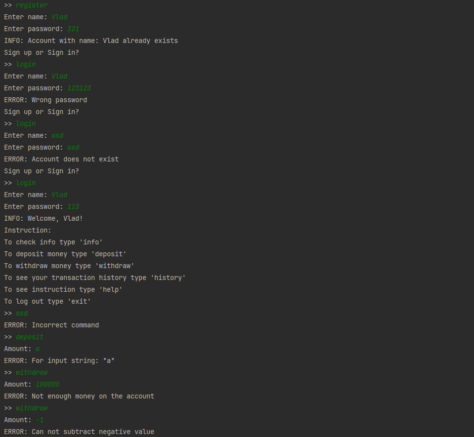

# Ylab banking system (Java core + Collections)
####  Technologies: Java 17, JUnit, Mysql

### To start project you need to:
1) Change name, password and url in util/DatabaseConnection.java (If not mysql - add db dependency)
2) Run resources/V5__Insert_Default_Transaction_types.sql
3) Run java/ApplicationStarter.class 

### Registration and Account management:

### Exception handling

### Logs
