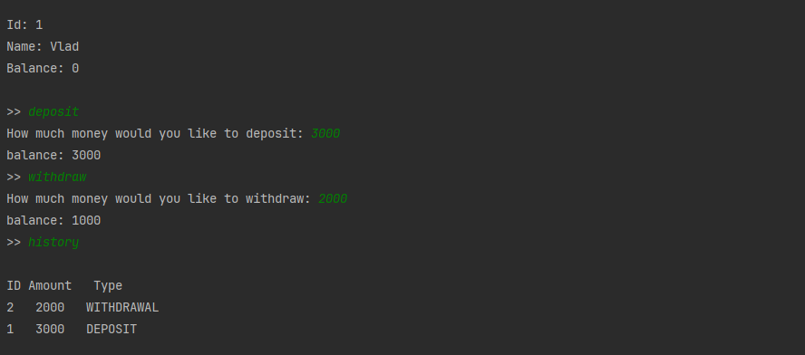
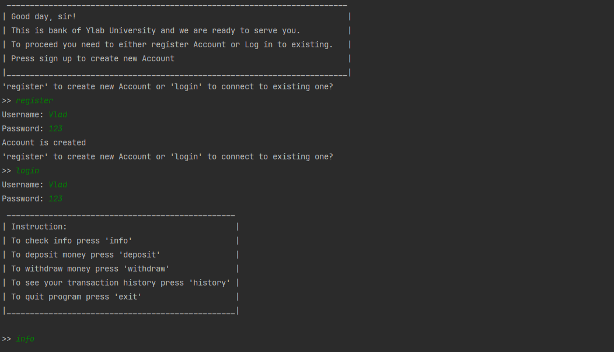
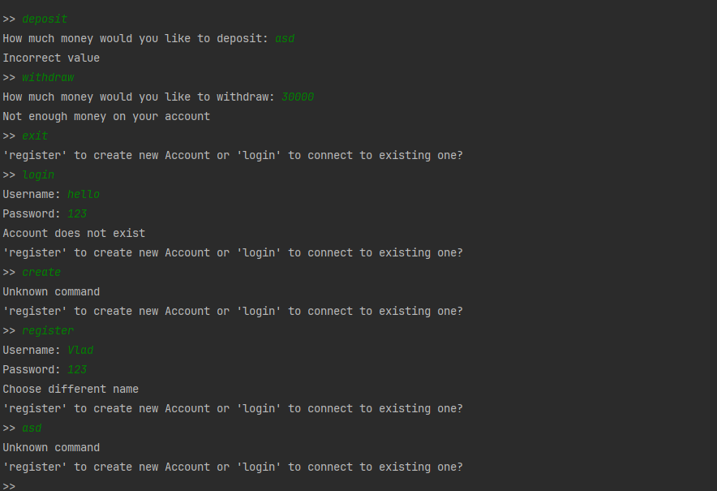

# Ylab banking system (Java core + Collections)
Version: Java 17

To start project you need to run api/Application.class 
### Registration and Account management:

### Exception handling

### Logs
